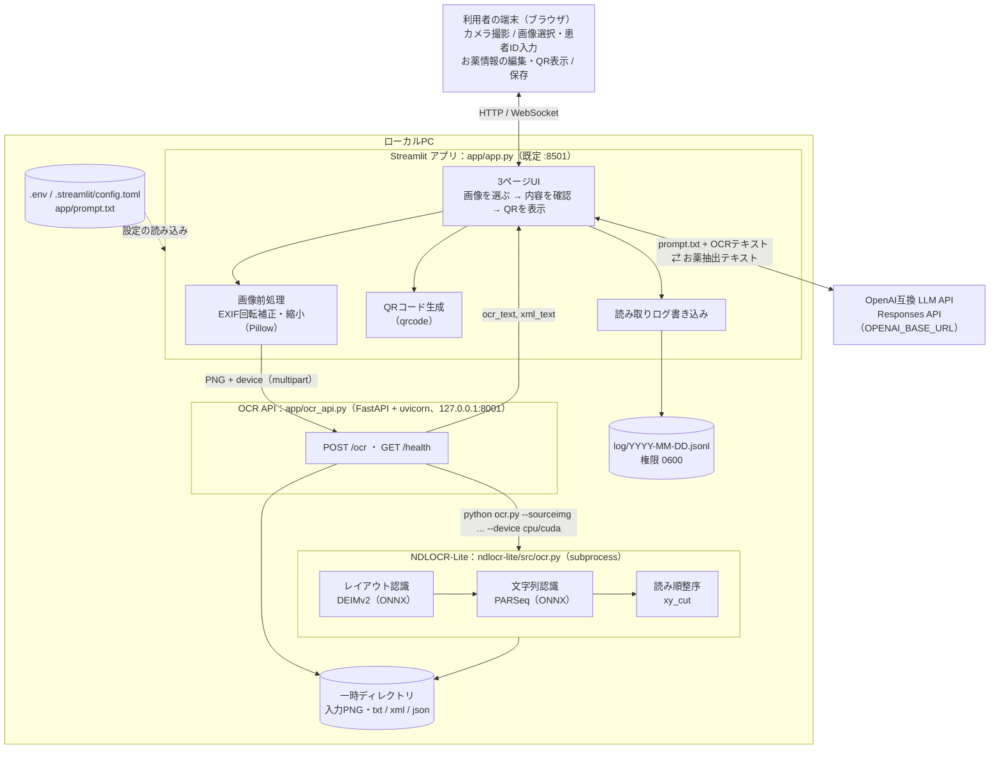
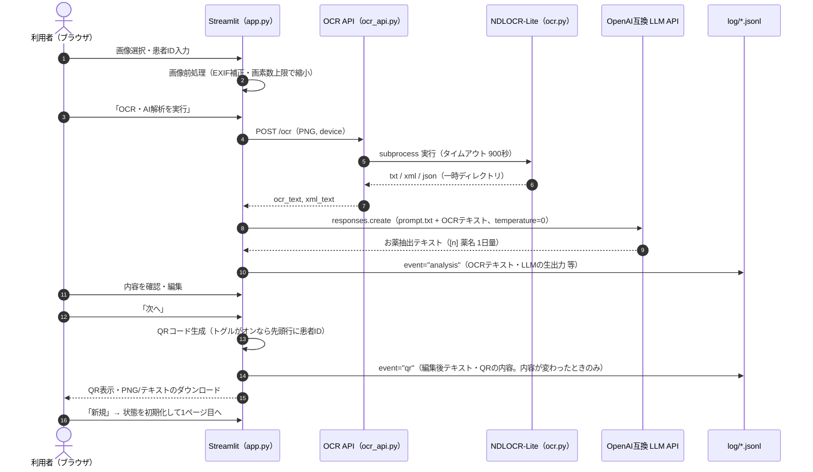

# お薬手帳OCRアプリ

`ndlocr-lite` を subprocess として実行する FastAPI OCR サーバーと、OpenAI 互換 API に対する1段階抽出で薬名と1日の服用量を整形する Streamlit アプリです。
低スペックなノートパソコンなどのローカル環境での動作を目的としています。

## 起動

※venv環境で、同ディレクトリにgit cloneした場合を想定しています。

依存関係をインストールします。

```bash
source .venv/bin/activate
pip install -r requirements.txt
```

ターミナル1で OCR API を起動します。

```bash
source .venv/bin/activate
uvicorn app.ocr_api:app --host 127.0.0.1 --port 8001
```

ターミナル2で Streamlit を起動します。

```bash
source .venv/bin/activate
streamlit run app/app.py
```

## 前提

- OpenAI 互換 API が利用できること
- Streamlit のサイドバーで `API URL`, `API Key`, `Model Name` を入力すること
- `OPENAI_BASE_URL`, `OPENAI_API_KEY`, `OPENAI_MODEL_NAME` を設定すると、サイドバー入力欄の初期値として使われる
- OCR API のデフォルト接続先は `OCR_API_URL=http://127.0.0.1:8001`
- `ndlocr-lite` の配置先を変える場合は OCR API 側で `NDLOCR_LITE_DIR` を設定すること
- Streamlit はリポジトリ直下から起動すること（`.streamlit/config.toml` は起動したディレクトリから読み込まれる）

## システム構成





## 読み取りログ

読み取り結果は `log/YYYY-MM-DD.jsonl`（`LOG_DIR` で変更可）に1行1レコードの JSON Lines で追記されます。患者IDと服薬情報を含むため、ファイル権限は 0600 で作成し、Git の管理対象外にしています。

- `event: "analysis"`: OCR・AI解析の完了時。`timestamp`, `record_id`, `patient_id`, `ocr_text`, `extracted_text_raw`（LLMの生出力）, `model_name`, `processing_seconds`, `image_sha256`
- `event: "qr"`: QR表示時（内容が変わるたびに1行）。`timestamp`, `record_id`, `patient_id`, `extracted_text_edited`（編集後のお薬情報）, `qr_text`, `patient_id_in_qr`, `qr_generated`

同じ読み取りの2種類のレコードは `record_id` で結合できます（例: `pandas.read_json(path, lines=True)`, `jsonlite::stream_in(file(path))`）。

## ライセンス

本アプリはOCR処理にNDLOCR-Liteを利用しています。

NDLOCR-Lite: https://github.com/ndl-lab/ndlocr-lite

- License: CC BY 4.0
- Copyright: National Diet Library / ndl-lab
